# [atet](https://github.com/atet) / [learn](https://github.com/atet/learn/blob/master/README.md#atet--learn) / [**_programming_**](https://github.com/atet/learn/blob/master/programming/README.md#atet--learn--programming)

# Loop Animation Frame-by-Frame

* [Click here to go back to tutorial](https://github.com/atet/learn/blob/master/programming/README.md#loop-concept)

## Loop Concept Animation

[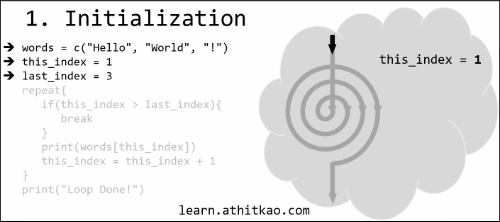](#nolink)

--------------------------------------------------------------------------------------------------

## Loop Concept Frame-by-Frame

[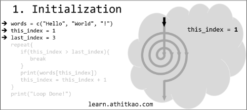](#nolink)

[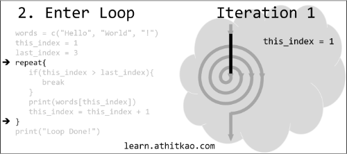](#nolink)

[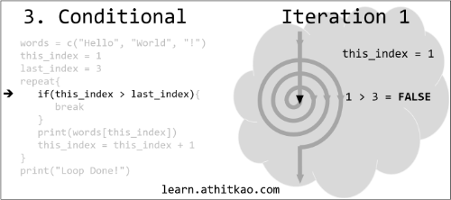](#nolink)

[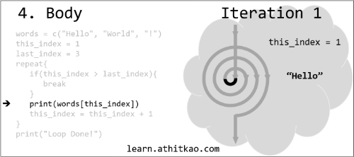](#nolink)

[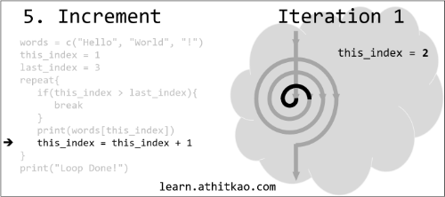](#nolink)

[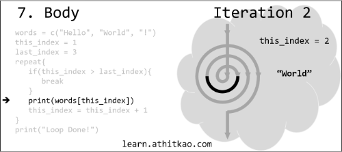](#nolink)

[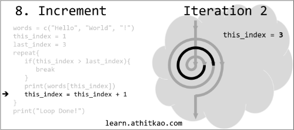](#nolink)

[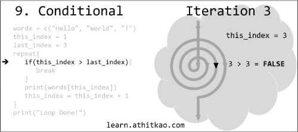](#nolink)

[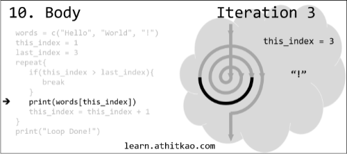](#nolink)

[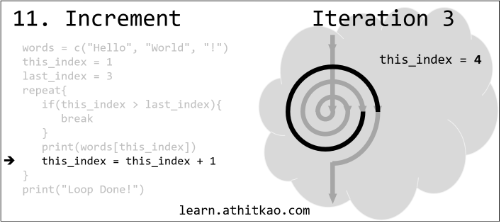](#nolink)

[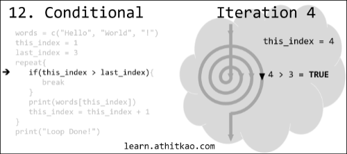](#nolink)

[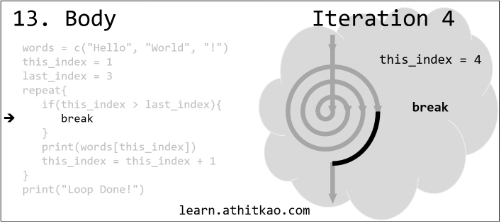](#nolink)

[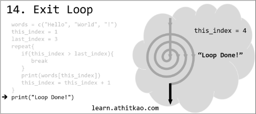](#nolink)

[Back to Top](#loop-animation-frame-by-frame)