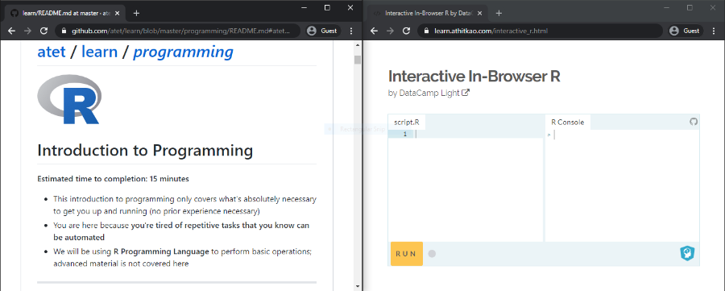
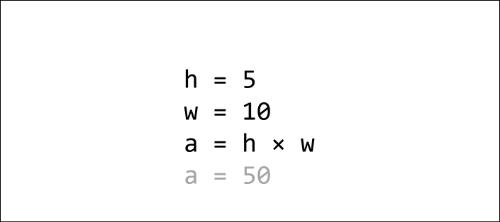
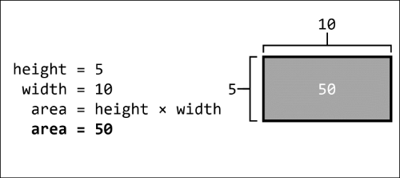
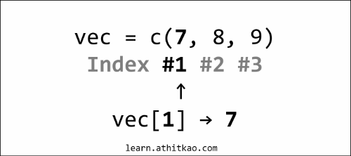
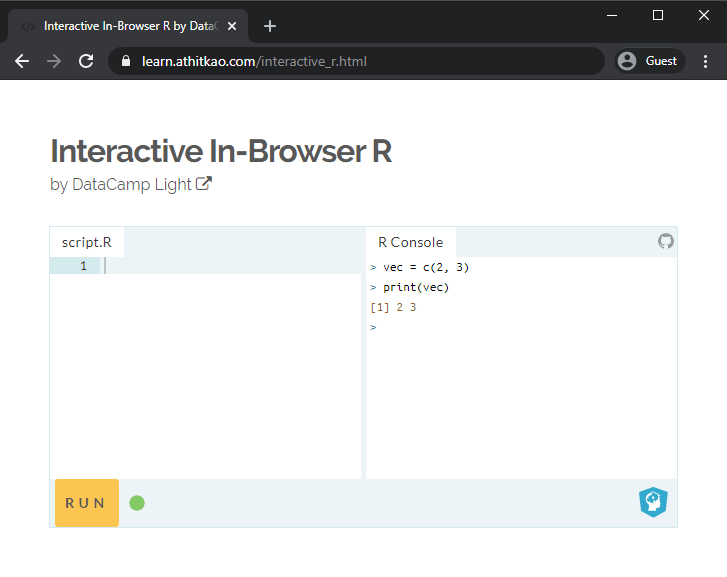
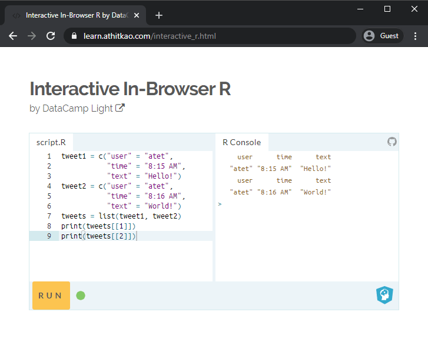
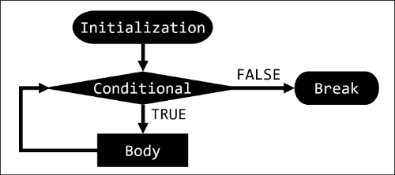
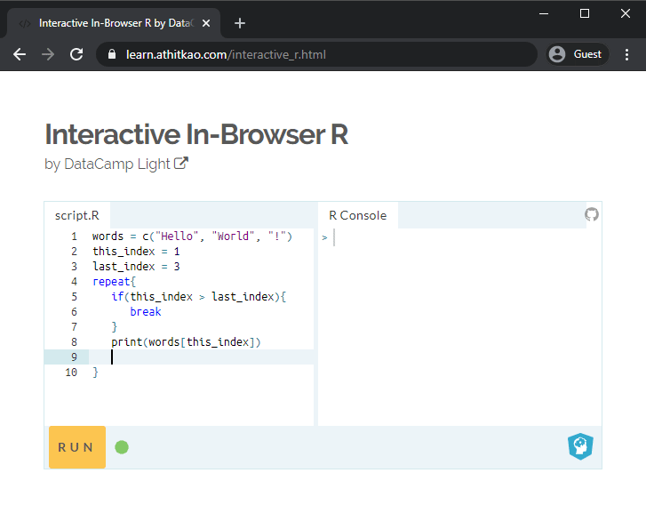
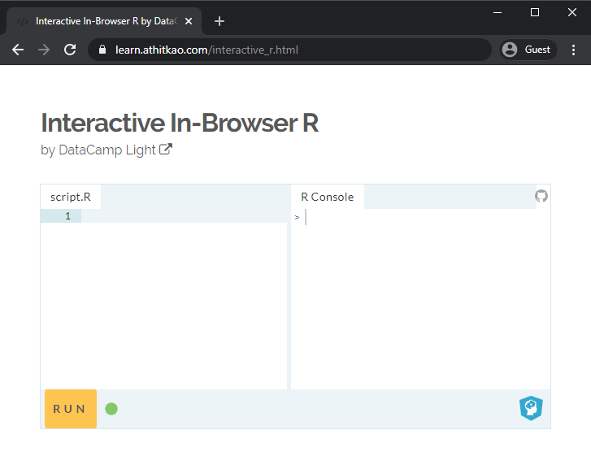
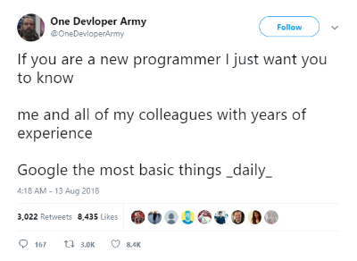

# [atet](https://github.com/atet) / [learn](https://github.com/atet/learn/blob/master/README.md#atet--learn) / [**_programming_**](https://github.com/atet/learn/blob/master/programming/README.md#atet--learn--programming)

[](#nolink)

# Introduction to Programming

**Estimated time to completion: 15 minutes**

* This introduction to programming only covers what's absolutely necessary to get you up and running (no prior experience necessary)
* We will be using **R Programming Language** to learn the critical building blocks of computer science

--------------------------------------------------------------------------------------------------

## Table of Contents

### Introduction

* [0. Requirements](#0-requirements)
* [1. Preface](#1-preface)
* [2. Environment](#2-environment)
* [3. Variables](#3-variables)
* [4. Operators](#4-operators)
* [5. Data Structures](#5-data-structures)
* [6. Control Structures](#6-control-structures)
* [7. Epilogue](#7-epilogue)
* [8. Next Steps](#8-next-steps)

### Supplemental

* [Other Languages](#other-languages)
* [Acknowledgments](#acknowledgments)

--------------------------------------------------------------------------------------------------

## 0. Requirements

**No prior programming experience necessary for this tutorial**

* **You don't need to download or install anything**; we will be using a web-based programming environment<sup>[[1]](#acknowledgments)</sup>: <a href="https://learn.athitkao.com/interactive_r.html" target="_blank">https://learn.athitkao.com/interactive_r.html</a>

[Back to Top](#table-of-contents)

--------------------------------------------------------------------------------------------------

## 1. Preface

* Q: Which language should I start my journey with?
   * A: Start with the language that offers you immediate progress without being bogged down with installing and configuring stuff
   * Programming languages are more similar than they are different; all share the same foundation of **_computer science theory_**
* Q: So R language is the same as Python?
   * A: The underlying theory of how things work is the same, just different syntax
   * Sometimes things are identical: The following code prints out "`Hello World!`" in both R and Python:
   ```r
   print("Hello World!")
   ```

[Back to Top](#table-of-contents)

--------------------------------------------------------------------------------------------------

## 2. Environment

**Let's get comfortable with your working environment for this tutorial**

* Use your web browser to access the programming environment on my website<sup>[[1]](#acknowledgments)</sup>: <a href="https://learn.athitkao.com/interactive_r.html" target="_blank">https://learn.athitkao.com/interactive_r.html</a>
* I recommend having these windows side-by-side during this tutorial:

[](#nolink)

* In this programming environment, the left side is the "**script**" and the right side is the "**console**"
* You can use either side to program, but results will only be printed out on the **console** side
* Now let's **watch the following animations** to see each side in action:
   * Note: Every section has animated figures to help you with abstract concepts and guide you with coding

### **Console**

> _Individual commands are run line-by-line after pressing **ENTER** on your keyboard<br>**NOTE: Ignore the "context menu"** that appears while you type for now)_
>
> [](#nolink)

### **Script**

> _Animation of the **script** side: Multiple commands can be executed at once by clicking on the **RUN** button_
>
> [](#nolink)

[Back to Top](#table-of-contents)

--------------------------------------------------------------------------------------------------

## 3. Variables

### **Theory of Variables**

* Recall **variables** from algebra:
   * A symbol that represents a number (e.g. `h = 5`)
   * Mathematical operations can be performed on variables (e.g. `a = h × w`)

> _We know that the variable `a` should be 50, but we would've had to calculate that from `a = h × w`_
>
> [](#nolink)


* Unlike the algebra homework in the previous example, there are helpful differences in computer programming:
   * The computer will handle remembering what values each variable is assigned and performing any calculations
   * It is common practice to give variables descriptive names to distinguish them and help _you_ remember what they represent

> _Once you tell the computer that `area = height × width`, the variable `area` is assigned the automatically computed value of 50_
>
> [](#nolink)

* If you were to re-write the above computation line-by-line in the R **console** area, you will see that R will automatically compute `height` multiplied by `width` for you when you print `area`:
   * Note: The multiplication symbol in programming is the asterisk "`*`" (SHIFT+8)

[](#nolink)

### **Simple Variable Types**

* The R language allows you to store different types of data such as **numbers** and **strings** (a.k.a. string of characters)
* Run the following code in the R **script** area to see the variable `var` store a number and then be overwritten with a string:

```r
var = 5 * 10
print(var)
var = "Hello World!"
print(var)
```

[](#nolink)

[Back to Top](#table-of-contents)

--------------------------------------------------------------------------------------------------

## 4. Operators

### **Basic Operators**

* We touched a bit on operators in the previous section by using the assignment and multiplication operator
   * **Assignment operator**: Assigns a value to a variable
      * Note: You can use either "`=`" or "`<-`" in R for assignment
   * **Mathematical operators**:
      Operator | Definition
      --- | ---
      `+` | Addition
      `-` | Subtraction
      `*` | Multiplication (asterisk, SHIFT+8)
      `/` | Division (forward slash)
      `^` | Exponent

* Remember that variables storing numbers can also use mathematical operators:
  * Note: We are using both options for assigment operator ("`=`" and "`<-`")

```r
print(100 - 50)
num1 = 100
num2 <- 50
print(num1 - num2)
```

[](#nolink)

### **Relational Operators**

* This class of operators encompass all the greater-than, less-than, and equals-to comparisons
* Unlike mathematical operators, these will result in a **Boolean** data type (can be either "`TRUE`" or "`FALSE`")

Operator | Definition
--- | ---
`<` | Less than
`>` | Greater than
`<=` | Less than or equal to
`>=` | Greater than or equal to
`==` | Equal to
`!=` | Not equal to

```r
10 <= 1
num1 = 10
num2 = 1
num1 > num2
num1 == num2
num1 != num2
```

[](#nolink)

### **Logical Operators**

* Piggybacking off the Boolean results (`TRUE`/`FALSE`) from relational operators, we can also compare Booleans  in logical operations

Operator | Definition
--- | ---
`&&` | "And" both must be `TRUE`
`\|\|` | "Or" at least one `TRUE`

```r
TRUE && TRUE
TRUE && FALSE
TRUE || TRUE
TRUE || FALSE
```

[](#nolink)

* We saw in the `!=` ("not equal to") relationship operator that the "`!`" means "not" a.k.a. "give me the opposite"
* Remember that the relationship operators will give Boolean results and those can be used with these logical operators

Operator | Definition
--- | ---
`!` | "Not" gives the opposite
`!TRUE` | `FALSE`
`!FALSE` | `TRUE`

```r
num1 = 1
num2 = 1
num1 != num2
!(num1 != num2)
```

[](#nolink)

[Back to Top](#table-of-contents)

--------------------------------------------------------------------------------------------------

## 5. Data Structures

**Earlier, we've seen simple number and string data types being stored in variables; now let's look at more complex data structures**

### **Vector**

* A variable can also represent a larger body of data
* You can group many individual pieces of data into a **vector** using `c()` and even reference individual pieces by index number using square brackets `[]`:
   * Note: Index numbers start from 1 in R

```r
vec = c(7,8,9)
print(vec)
print(vec[1])
print(vec[3])
```
[](#nolink)

[](#nolink)

### **Building a Vector**

* We can easily add new data into a vector by including the previous vector in the new vector
* Let's add some numbers in front of and at the end of an existing vector:

```r
vec = c(2, 3)
print(vec)
vec = c(1, vec)
print(vec)
vec = c(vec, 4)
print(vec)
```

[](#nolink)

### **Named Vector**

* A vector of numbers doesn't sound too exciting, how about Twitter tweets?
* Since there's a bit more complicated data with tweets, we can extend vectors to giving each index a name (can still reference by number):
   * Note: Try running the first half on the script side and the remainder on the console side

```r
tweet1 = c("user" = "atet",
           "time" = "8:15 AM",
           "text" = "Hello!")
print(tweet1)
print(tweet1["user"])
print(tweet1[1])
```

[](#nolink)

### **List**

* What if we need to store a collection of complex variables types?
* Unfortunately, vectors cannot store other vectors as seen in the Building a Vector section
* **Lists** can store vectors by placing vectors between the parentheses of "`list()`"
* Below, we will build a list of two named vectors and reference indices by name and number:
   * Note: You must use double square brackets with **lists** and single brackets with vectors

```r
tweet1 = c("user" = "atet",
           "time" = "8:15 AM",
           "text" = "Hello!")
tweet2 = c("user" = "atet",
           "time" = "8:16 AM",
           "text" = "World!")
tweets = list(tweet1, tweet2)
print(tweets[[1]])
print(tweets[[2]])
print(tweets[[1]]["text"])
print(tweets[[2]][3])
```

[](#nolink)

[](#nolink)

### **Data Range**

* R has some handy shortcuts to help when dealing with ranges of numbers
* If we had to make an ordered vector of numbers from 1 to 10 (_or a billion!_), we could use the special colon ("`:`") operator to help:

```r
print(c(1,2,3,4,5,6,7,8,9,10))
print(c(1:10))
```

[](#nolink)

[Back to Top](#table-of-contents)

--------------------------------------------------------------------------------------------------

## 6. Control Structures

**Earlier, we've used Booleans for comparisons; now let's use them to control what code will run**

### **Conditional Statements**

* Booleans can also control what code will run in conditional statements
* The example below shows an "`if`" conditional statement that executes only when the result within the `if()`'s parenthesis is `TRUE`:
   * Note: You must use curly brackets ("`{}`") to surround the code that will run with a `TRUE` `if` statement

```r
tweet_count = 5

if(tweet_count > 10){
   print("That's a lot of tweets!")
}

tweet_count = tweet_count + 100

if(tweet_count > 50){
   print("Too many tweets!")
}
```

* If we run the above code, we will see that only the second `if` statement executes ("`Too many tweets!`") since its condition was satisfied (`tweet_count` of 150 is greater than 50)
* We can use "`else`" statements in conjunction, which execute only when the `if` condition is **not** satisfied

```r
tweet_count = 7

if(tweet_count > 10){
   print("That's a lot of tweets!")
}else{
   print("Get more tweets!")
}
```

* These examples seem to be pretty benign, but maybe you'll have to use these control structures for something important one day:

```r
ants = 1000
if(ants > 900){
   print("Start exterminator program...")
}
```

[](#nolink)

### **Loops**

**Our final topic will combine data structures with conditional statements to produce a powerful programming tool**

* Essentially loops will help you plow through a lot of data quickly by literally "looping" through code
* It may help to think of loops conceptually rather than the actual code you see
* There are three essential parts to a loop:
1. Initialization - Code that sets the starting parameters of a loop
2. Condition - A condition that must be satisfied to continue the loop
3. Body - Code that will execute if the condition remains TRUE

[](#nolink)

* If we run the loop below, we see that the variable `this_index` continues to increment every loop iteration until it is no longer less than `last_index` and "`break`s" out of the loop
* As the loop iterates, `this_index` increments and is used to print out different indices from the vector `words`
   * Note: [Click here to see loop animation frame-by-frame](https://github.com/atet/learn/blob/master/programming/.img/step06c/README.md#atet--learn--programming)

```r
words = c("Hello", "World", "!")
this_index = 1
last_index = 3
repeat{
   if(this_index > last_index){
      break
   }
   print(words[this_index])
   this_index = this_index + 1
}
print("Loop Done!")
```

[](#nolink)

[](#nolink)

* Computers work blazingly fast to our benefit; running the above loop finishes instantaneously
* Let's see if we can push the limits by figuring out if 216,091 is a prime number (divisible only by 1 and itself)
* We can do this by looping through integers 2 through 108,046 (about half of 216,091) and seeing if any of them divide cleanly without any remainder
   * Note: We will use the modulus mathematical operator "`%%`" that will calculate any remainder from a division, e.g. `4 %% 2 = 0` while `5 %% 2 = 1`

```r
dividend = 216091
divisor = 2
repeat{
   if(divisor > (dividend/2)){
      print("I am a prime!!!")
      break
   }
   if((dividend %% divisor) == 0){
      print("I am not a prime.")
      break
   }
   divisor = divisor + 1
}
```

[](#nolink)

**Holy cow that was quick!** I don't know about you, but I wouldn't have wanted to perform 100,000+ divisions even _with_ a calculator

[Back to Top](#table-of-contents)

--------------------------------------------------------------------------------------------------

## 7. Epilogue

* We have reviewed the critical building blocks needed for a strong foundation of computer science theory
* These themes will echo in every programming language and are components to even the most complex programs
* Always remember: If you ever reach a roadblock, your answer is just a well-crafted Google search away:

[](#nolink)

[Back to Top](#table-of-contents)

--------------------------------------------------------------------------------------------------

## 8. Next Steps

* I recommend going over this material one more time to solidify these concepts
* You can continue to use the same web-based programming environment as you continue into advanced concepts; **no need to distract yourself with installing things** right now
* There is so much free educational materials out on the internet, find the best content that fits your learning style

[Back to Top](#table-of-contents)

--------------------------------------------------------------------------------------------------

## Other Languages

* Regardless of the difference in syntax between languages, they will all share a common theory of how things work
* All languages will have variables, operators, data types, data structures, and control structures
* Here's an example of the similarities and differences in three popular programming languages

### **R Syntax**

> The words "`Hello World!`" are stored in the variable `greeting` and then "printed" out
>
> ```
> > greeting <- "Hello World!"
> > print(greeting)
> [1] "Hello World!"
> ```

### **Python Syntax**

> The exact same thing as above was performed, but Python doesn't use `<-` as an assignment operator
>
> ```
> >>> greeting = "Hello World!"
> >>> print(greeting)
> Hello World!
> ```

### **JavaScript Syntax**

> The exact same thing as above was performed, but JavaScript has different syntax for printing to console
>
> ```
> > greeting = "Hello World!"
> > console.log(greeting)
> Hello World!
> ```

[Back to Top](#table-of-contents)

--------------------------------------------------------------------------------------------------

## Acknowledgments

1. Web-based R console by DataCamp: <a href="https://github.com/datacamp/datacamp-light" target="_blank">https://github.com/datacamp/datacamp-light</a>

<a href="" target="_blank"></a>

[Back to Top](#table-of-contents)

--------------------------------------------------------------------------------------------------

<p align="center">Copyright © 2019-∞ Athit Kao, <a href="http://www.athitkao.com/tos.html" target="_blank">Terms and Conditions</a></p>