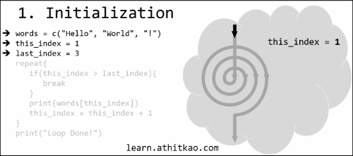

# [atet](https://github.com/atet) / [learn](https://github.com/atet/learn/blob/master/README.md#atet--learn) / [**_programming_**](https://github.com/atet/learn/blob/master/programming/README.md#atet--learn--programming)

[](#nolink)

# Introduction to Programming (INCOMPLETE)

**Estimated time to completion: 15 minutes**

* This introduction to programming only covers what's absolutely necessary to get you up and running
* You are here because you're tired of repetitive tasks that you know can be automated
* We will be using **R Programming Language** to perform basic operations; advanced material is not covered here

--------------------------------------------------------------------------------------------------

## Table of Contents

### Introduction

* [0. Requirements](#0-requirements)
* [1. Preface](#1-preface)
* [2. Environment](#2-environment)
* [3. Variables](#3-variables)
* [4. Operators](#4-operators)
* [5. Structures](#5-structures)
* [6. Loops](#6-loops)
* [7. Epilogue](#7-epilogue)
* [8. Next Steps](#8-next-steps)

### Supplemental

* [Other Languages](#other-languages)
* [Acknowledgments](#acknowledgments)

--------------------------------------------------------------------------------------------------

## 0. Requirements

**No prior programming experience necessary for this tutorial**

* **You don't need to download or install anything**; we will be using a web-based programming environment in this tutorial<sup>[[1]](#acknowledgments)</sup>: <a href="https://learn.athitkao.com/interactive_r.html" target="_blank">https://learn.athitkao.com/interactive_r.html</a>
* I recommend having these windows side-by-side during this tutorial:

[](#nolink)

[Back to Top](#table-of-contents)

--------------------------------------------------------------------------------------------------

## 1. Preface

* Q: Is programming difficult?
   * A: 
* Q: Which language should I start my journey with?
   * A: 
   * Programming languages are more similar than they are different; they share the same foundation of **_computer science theory_**
* Q: So R language is the same as Python?
   * A: The underlying theory of how things work is the same, just different syntax
   * e.g. The following line of code prints out "`Hello World!`" to the console in both R and Python languages:
   ```
   print("Hello World!")
   ```

[Back to Top](#table-of-contents)

--------------------------------------------------------------------------------------------------

## 2. Environment

**Let's get comfortable with your working environment for this tutorial**

* Use your web browser to access the programming environment on my website<sup>[[1]](#acknowledgments)</sup>: <a href="https://learn.athitkao.com/interactive_r.html" target="_blank">https://learn.athitkao.com/interactive_r.html</a>
* The left side is the "**script**" and the right side is the "**console**"
* You can use either side to program, but results will only be printed out on the **console** side
* Now let's watch the following animations to see each side in action:

### **Console**

> _Individual commands are run line-by-line after pressing **ENTER** on your keyboard (**Ignore the "context menu"** that appears while you type for now)_
>
> [](#nolink)

### **Script**

> _Animation of the **script** side: Multiple commands can be executed at once by clicking on the **RUN** button_
>
> [](#nolink)

[Back to Top](#table-of-contents)

--------------------------------------------------------------------------------------------------

## 3. Variables

### **Theory of Variables**

* Recall **variables** from algebra:
   * A symbol that represents a number (e.g. `h = 5`)
   * Mathematical operations can be performed on variables (e.g. `a = h × w`)

> _We know that the variable `a` should be 50, but we would've had to calculate that from `a = h × w`_
>
> [](#nolink)


* Unlike algebra homework, there are helpful differences in computer programming:
   * The computer will handle remembering what values each variable is assigned and performing any calculations
   * It is common practice to give variables descriptive names to distinguish them and help _you_ remember what they represent

> _Once you tell the computer that `area = height × width`, the variable `area` is assigned the automatically computed value of 50_
>
> [](#nolink)

* If you were to re-write the above computation line-by-line in the R **console** area, you will see that R will compute `height` multiplied by `width` for you when you print `area`:
   * Note: The multiplication symbol in programming is the asterisk "`*`" (SHIFT+8)

[](#nolink)

### **Simple Variable Types**

* The R language allows you to store different types of data such as **numbers** and **strings** (of characters)
* Run the following code in the R **script** area to see the variable `var` store a number then be overwritten with a string:

```r
var = 5 * 10
print(var)
var = "Hello World!"
print(var)
```

[](#nolink)

[Back to Top](#table-of-contents)

--------------------------------------------------------------------------------------------------

## 4. Operators

### **Basic Operators**

* We touched a bit on operators in the previous section by using the assignment and multiplication operator
   * **Assignment operator**: Assigns a value to a variable
      * You can use either "`=`" or "`<-`" in R
   * **Mathematical operators**:
      Operator | Definition
      --- | ---
      `+` | Addition
      `-` | Subtraction
      `*` | Multiplication (asterisk, SHIFT+8)
      `/` | Division (forward slash)
      `^` | Exponent

* Remember that variables storing numbers can also use mathematical operators:

```r
print(100 - 50)
num1 = 10
num2 <- 5
print(num1 - num2)
```

[](#nolink)

### **Relational Operators**

* This class of operators encompass all the greater-than, less-than types
* Unlike mathematical operators, these will result in a **boolean** data type (can be either "`TRUE`" or "`FALSE`")

Operator | Definition
--- | ---
`<` | Less than
`>` | Greater than
`<=` | Less than or equal to
`>=` | Greater than or equal to
`==` | Equal to
`!=` | Not equal to

### **Logical Operators**

* Piggybacking off the boolean results from relational operators, we can also compare `TRUE`/`FALSE` in logical operations

Operator | Definition
--- | ---
`&&` | "And" both must be `TRUE`
`||` | "Or" at least one `TRUE`

```r
!TRUE
TRUE && TRUE
TRUE && FALSE

```

Operator | Definition
--- | ---
`!` | "Not" gives the opposite


[Back to Top](#table-of-contents)

--------------------------------------------------------------------------------------------------

## 5. Structures

**Earlier, we've seen simple data types being stored in variables; now let's look at more complex data structures**

### **Vector**

* A variable can also represent a larger body of data
* You can group many individual pieces of data into a **vector** using `c()` and even reference individual pieces by index number using square brackets `[]`:
   * Note: Index numbers start from 1 in R

```r
vec = c(7,8,9)
print(vec)
print(vec[1])
print(vec[3])
```

[](#nolink)

### **Named Vector**

* A vector of numbers doesn't sound too exciting, but let's imagine you have an intern transcribing your favorite Twitter tweets into R
* We can extend vectors to giving each index a name (though you can still reference them by index number):
   * Note: Try running the first half on the script side and the remainder on the console side

```r
tweet1 = c("user" = "atet",
           "time" = "8:15 AM",
           "text" = "Hello!")
print(tweet1)
print(tweet1["user"])
print(tweet1[1])
```

[](#nolink)

### **List**

* We see that this tweet is a named vector, but how do we store a collection of these complex variables types?
* Unfortunately, vectors cannot store other vectors
* Fortunately, we can use **lists** and reference individual indices the same way we did with vectors:
   * Note: You must use double square brackets with **lists** instead of the single bracket with vectors

```r
tweet1 = c("user" = "atet",
           "time" = "8:15 AM",
           "text" = "Hello!")
tweet2 = c("user" = "atet",
           "time" = "8:16 AM",
           "text" = "World!")
tweets = list(tweet1, tweet2)
print(tweets[[1]])
print(tweets[[2]])
print(tweets[[1]]["text"])
```

[](#nolink)

### **Data Range**

* R has some handy shortcuts to help when dealing with ranges of numbers
* If we had to make an ordered vector of numbers from 1 to 10 (_or a billion!_), we could use the special colon ("`:`") operator to help:

```r
print(c(1,2,3,4,5,6,7,8,9,10))
print(c(1:10))
```

[](#nolink)

[Back to Top](#table-of-contents)

--------------------------------------------------------------------------------------------------

## 6. Loops

**Now that we have mastered operators and data structures, let's combine what we've learned to make a powerful program**


[Back to Top](#table-of-contents)

--------------------------------------------------------------------------------------------------

## 7. Epilogue

* We have reviewed some of the critical building blocks needed for a strong foundation of computer science theory
* These themes will echo in every programming languages and are components to even the most complex programs like

[Back to Top](#table-of-contents)

--------------------------------------------------------------------------------------------------

## 8. Next Steps

* I recommend going over this material one more time 

[Back to Top](#table-of-contents)

--------------------------------------------------------------------------------------------------

## Other Languages
 
### **R Syntax**

> The words "`Hello World!`" are stored in the variable `greeting` and then "printed" out
>
> ```
> > greeting <- "Hello World!"
> > print(greeting)
> [1] "Hello World!"
> ```

### **Python Syntax**

> The exact same thing as above was performed, but Python has different syntax
>
> ```
> >>> greeting = "Hello World!"
> >>> print(greeting)
> Hello World!
> ```


* Play around with the software, make new worksheets with interesting visualizations.
* Find new data on the internet and learn new ways to use Tableau.
* If you are an Excel and/or R user, think about how your analysis workflow would be different using Tableau.
* Resources:

Description | Link
--- | ---
Sample Data | <a href="https://public.tableau.com/en-us/s/resources?qt-overview_resources=1#qt-overview_resources" target="_blank">https://public.tableau.com/en-us/s/resources?qt-overview_resources=1#qt-overview_resources</a>
How-To Videos | <a href="https://public.tableau.com/en-us/s/resources?qt-overview_resources=0#qt-overview_resources" target="_blank">https://public.tableau.com/en-us/s/resources?qt-overview_resources=0#qt-overview_resources</a>

[Back to Top](#table-of-contents)

--------------------------------------------------------------------------------------------------

## Acknowledgments

1. Web-based R console by DataCamp: <a href="https://github.com/datacamp/datacamp-light" target="_blank">https://github.com/datacamp/datacamp-light</a>

<a href="" target="_blank"></a>

[Back to Top](#table-of-contents)

--------------------------------------------------------------------------------------------------

<p align="center">Copyright © 2019-∞ Athit Kao, <a href="http://www.athitkao.com/tos.html" target="_blank">Terms and Conditions</a></p>